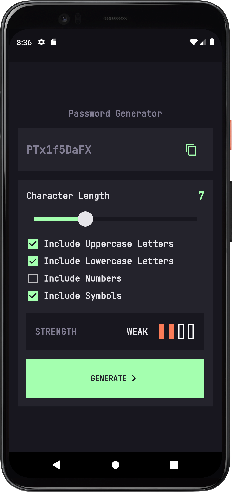
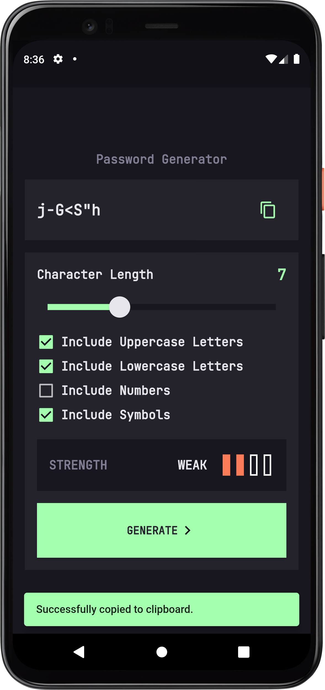

# Password Generator

  

  

  

  

  

    
    
    

## 💻 Informações sobre o projeto

Aplicativo para gerar senhas seguras.

* É possivel escolher a quantidade de caracteres da senha, de 1 a 20.
* É possivel gerar senhas com letras maiúsculas.
* É possivel gerar senhas com letras minúsculas.
* É possivel gerar senhas com números.
* É possivel gerar senhas com símbolos.

## ⚙ Tecnologias

